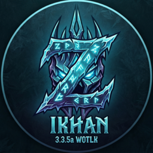

# Realm of Ikhan Launcher

A custom, high-performance desktop launcher for the **Realm of Ikhan** World of Warcraft private server (Wrath of the Lich King 3.3.5a).



## Features

-   **High-Speed P2P Summoning:** Built-in WebTorrent engine for fast, resilient game client downloads.
-   **Smart Detection:** Automatically finds Steam libraries and common game directories for a seamless setup.
-   **MultiBot Integration:** Easily toggle the MultiBot addon to recruit automated party members for your adventures.
-   **Dynamic Realmlist:** Automatically ensures your `realmlist.wtf` is correctly configured for the Ikhan realm before every launch.
-   **Cross-Platform Support:** Native support for Windows and Linux (via Wine).
-   **Modern UI:** A clean, immersive "Frozen Throne" interface designed with React and custom CSS.

## Getting Started

### Prerequisites

-   **Windows:** No special requirements.
-   **Linux:** Ensure `wine` is installed for the best experience.

### Usage

1.  Launch the application.
2.  Select your desired **Installation Directory**.
3.  Click **Install Game** to download the game client via P2P.
4.  Once ready, click **Play Now** to launch World of Warcraft.

## Building from Source

If you want to build the launcher yourself:

1.  **Clone the repository:**
    ```bash
    git clone https://github.com/Zelixo/wowlauncher.git
    cd wowlauncher
    ```

2.  **Install dependencies:**
    ```bash
    npm install
    ```

3.  **Create a branded installer:**
    ```bash
    npm run make
    ```

## Community

Join our **War Room** on Discord: [Join Discord](https://discord.gg/kv6hCjvMbp)

---

*STAY COOL OUT THERE, IT'S SNOW JOKE!*
